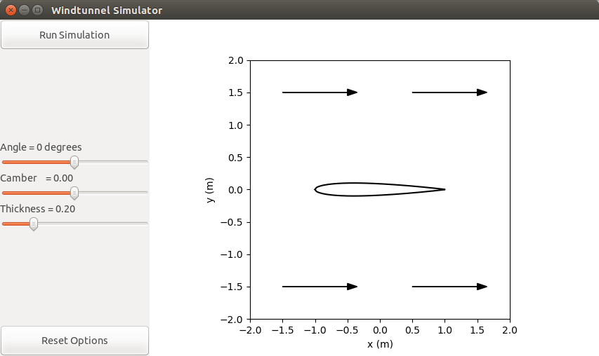
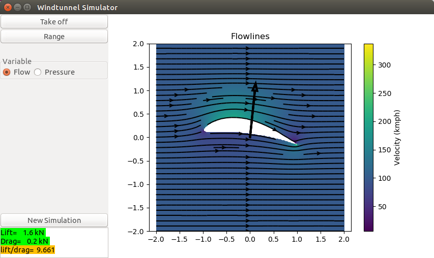
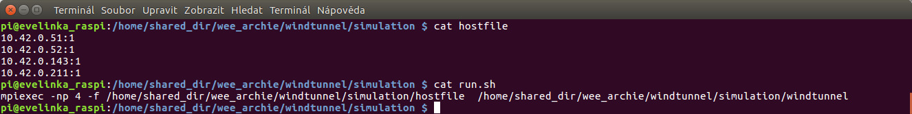
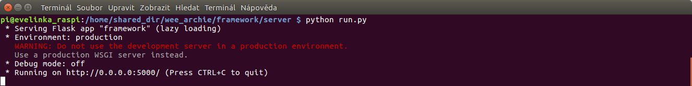

# Instructions for running the windtunnel CFD program

## Prerequisites

To run this demo you will need on your local machine:

* `git` to clone the distribution from GitHub.
* `Python`, we assume the [anaconda distribution](https://www.anaconda.com/distribution/).
* `make` to compile the fluid dynamics code.
* An MPI distribution
* A `Fortran` compiler, [GNU Fortran](http://gcc.gnu.org/fortran/) will work.

## Download and clone

* Open a terminal
* Go to a local directory where you wish to install the application
* Clone the program to the directory, i.e type:

```bash
     git clone https://github.com/EPCCed/wee_archie.git
```
The program downloads to a new folder called: `wee_archie`.

* Change directory to the wee archie folder
```bash
     cd wee_archie
     git branch
```

## Python

We are also going to assume that you have an [Anaconda Python
distribution](https://www.anaconda.com/distribution/) installed
otherwise you will have to use `pip` or `easy_install` to install any
missing packages. Even with anaconda you may need to install some
additional packages. For instance, with Python 3 you may also need to
do the following:

```bash
conda install wxpython
conda install netcdf4
conda install vtk
```

**NOTE**: For Python 2 instead of ”wxpython” you need ”wxwidgets”.


## Running the program on laptop only

To start with, we need to `make` the program so:

* Go to:

```bash
cd windtunnel/simulation
```

* Type:
```
make
```

* Change back to the main `windtunnel` folder 
```bash
cd ..
```
• You need to edit the `windtunnel_ui.py` file.

First, because now we want to run the program on a single machine only
we need to ”switch off the server option”. So open the file with your
favourite editor, find a variable `self.serverversion` (should be line
26) and set it to ”False”, i.e.
```
     self.serverversion=False
```
Second, in the same file find a line that contains `mpiexec` (should be line 311) and change it so that it only requires one node, i.e.
```
     subprocess.call(["mpiexec","-n","1","./simulation/windtunnel"])
```

This is to ensure that the program will run smoothly on a single
machine that does not have mutiple nodes. (The default setup was for 4
nodes, 2 processes each while now we changed it to 1 node with 2
processes only.) Save the changes and close the file.

* Open the file `range.py` and go to lines 271, 272 where variables
  `nph` and `nth` are initialized. Change them so the lines look as
  follows:
```
     nph=int(res)
     nth=int(res/2)
```

This is just a bug fix due to the fact that Python 2 and Python 3
treat integer differently. (This change might not be
necessary for Python 2, but does not do any harm.)

* Finally, run the code, type to the command line:
```
python Start.py 
```
A new window should open: 



Now you can adjust the shape of the wing on the screen with the slider
bars on the left. Then click on ”Run Simulation”. The computation
might take a while. Once it is finished the flow lines graph will be
shown:



You can click on `Take off` button on the left to see if the airplane
with such a wing would take off or crash.

## Running on a cluster

In this section we assume that you have a cluster available to you,
like the [Wee Archie](https://epcced.github.io/wee_archlet/)
Raspberry-Pi cluster, and the cluster is set up so that all the
cluster nodes have access to a shared directory space and that you can
do an `ssh` connection from a host to the cluster. It is also assumed
that you have firstly run the simulation on a single machine so all
the adjustments in the previous section have been done. The following
instructions assume that you are using a Wee Archie type of system.

### Part 1

* Copy the program (the folder ”wee archie”) to the cluster shared
  directory. Type to the command line on the laptop:
```
scp -r wee_archie/ pi@ip_address_of_the_master:/path_to_the_cluster_shared_directory
```
* Login through ssh to the master node of the cluster.
* Change directory to the ”simulation” folder and make the program, type
```
     cd /wee_archie/windtunnel/simulation
     make clean
     make
```
Make sure to `make clean` first before doing `make`. This is because
we copied the program from the laptop where `make` had been done
before but the laptop might have different software, libraries etc
installed than the cluster.

* Create a `hostfile` that specifies on which nodes and how many MPI
  copies you want to run. For example if you want to use 4 worker
  nodes, each one MPI copy. Use your favourite editor, in this case
  `vim` is being used but don't use `vim` unless you know what you are
  doing:
```
vim hostfile
```
and then insert the IP adresses of the cluster nodes you want the
simulation to run on and the number of MPI copies each node should
run, the format is as follows
```
     IP_address_of_worker1:1
     IP_address_of_worker2:1
     IP_address_of_worker3:1
     IP_address_of_worker4:1
```

* Create a file called `run.sh` that should contain just one line
  which is the `mpiexec` command:
```
     mpiexec -np 4 -f /simulation_folder_path/hostfile /simulation_folder_path/windtunel
```
Where `-np 4` flag specifies that there will be 4 MPI copies created and the
`hostfile` gives information where these copies should be run. Do make
sure you specify full paths to the hostfile and the executable file
”windtunnel”! For clarity, see my hostfile and `run.sh` file below.



### Part 2 - Database

ToDo: More info on the database is required.

* You will need an SQLite database `simulations.db` file. The file
  needs to be adjusted for your use. He might need some info from you.
* Download the `simulations.db` file to your head node.

* Copy the file from the laptop to the shared folder on the cluster to
  the `/wee archie/framework/server` folder. So to the head node you
  will need to type something like:
```
     scp Downloads/simulations.db pi@10.42.0.46:/home/shared_dir/wee_archie_framework/server
```
You will need to adjust the paths to the directories and the IP
address of the cluster master node according to your setup.


### Part 3 - Run

* On the master node go to the `/framework/server` directory :
```
     cd ../..
     cd framework/server
```
* Type to the command line:
```
     python run.py
```
This should get ready the simulation to be run on the cluster. The
terminal should now look as follows

The simulation has not started yet though, it needs to be done from
the laptop command line.
* In case the command `run.py` does not work, i.e. the program
  complains, you might need to install some libraries. In my case I
  needed to install `flask` and in order to do that I needed `pip` as
  well so I typed
```
     sudo apt-get install python-pip
     pip install flask
```
  And then tried again `python run.py` which worked. 
* The cluster setup is finished, the last bit is to start the program
  from the laptop. In the laptop `wee archie/windtunnel/simulations`
  folder in file `windtunel_ui.py` make sure that the variable
  `self.serverversion` is set to `True`, because now we want the
  computation part of the simulation to be done on the cluster. Only
  the GUI will run on the laptop.
* On the laptop terminal command line type:
```
     python Start.py -s http://10.42.0.46:5000 -c 5
```
Again, you need to adjust the IP address to your master node IP
address. This should open the Wintunnel simulation window and now you
can play with the simulation similarly as if when it was running on
the laptop only.  Works? Well done!
   
<!-- Licensing and copyright stuff below -->
<br>
<a href="http://www.epcc.ed.ac.uk">

</a>
<a rel="license" href="https://opensource.org/licenses/BSD-3-Clause">

</a><br />
This work is licensed under a <a rel="license" href="https://opensource.org/licenses/BSD-3-Clause">
BSD 3-Clause License</a>.<br/>
&copy; Copyright EPCC, The University of Edinburgh 2018.
