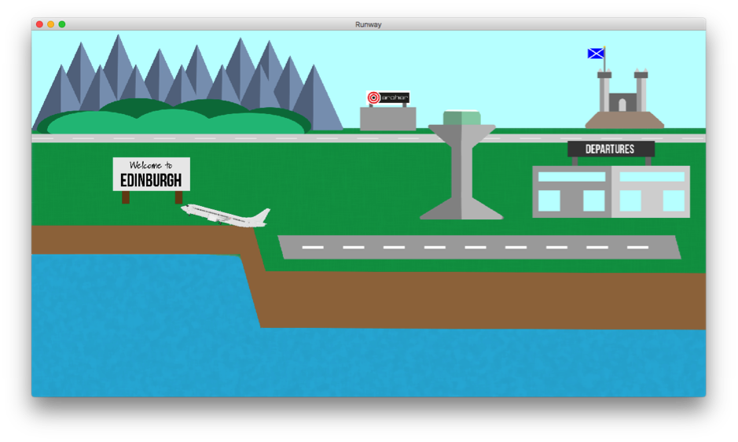

# Aircraft Wing Design Simulation

The computational fluid dynamics (CFD) demonstration allows users to 
design an aeroplane wing by modifying design parameters. Then using a 
parallel simulation code see if their aeroplane wing enables a plane to take
off and how far it could fly.

The aim of the demonstration is to give users a chance to try a supercomputer application.
This will help to motivate discussions about:

* the need for supercomputers
* uses of supercomputers
* the benefits of using large systems
    * speeding up computation times
    * Cost, for example reducing the number of physical prototypes

The demo is split into three main stages: design, compute and results. During
each stage different things can be discussed with the user, depending on their
age, experience and enthusiasm. These will be covered below:

## Wing design

The wing design screen is shown below. The controls on the left are
sliders to adjust the wing design, run and reset buttons. 
The run button will start the simulation and the reset button will reset the parameters to default.
The main graphic shows the current wing shape. The arrows indicate airflow direction.

The user can alter the wing by changing the parameters governing the wing shape. 
There are three parameters:

* Angle (of attack) – the angle at which the wing is tilted at relative to
oncoming airflow, this can be adjusted between ±45 degrees.

* Camber – the degree of curvature of the wing. This can be adjusted
between ±0.3

* Thickness – how thick the wing is. This can be adjusted between 0.1 and
0.6.

The wing shape is based on a NACA 4-digit cambered aerofoil.

### Note

For further information see [NACA Foil](https://en.wikipedia.org/wiki/NACA_airfoil#Equation_for_a_cambered_4-digit_NACA_airfoil)

When the user is happy with their wing, click “Run Simulation” to submit the
design to Wee Archie. Wee Archie will run a simulation and calculate the design's aerodynamic properties.

### Points to discuss:
* What shape properties could help or hinder the lift and drag generated by the wing? 
* Why would you want to design a wing?
    * planes
    * wind turbines
    * propellers
    * hydrofoils
    * other ideas

## Running the simulation

While the simulation is running, the design controls will be disabled. The main graphic will display dashed lines
over the wing design. These lines show how the calculations are parallelised, allowing a
discussion about how problems can be split up into smaller chunks to be worked on in parallel.
The calculations take around 30 seconds to complete.

### Points to discuss:
* The concepts of parallelisation – why it speeds things up
* How the problem is split up into chunks, being worked on by each Pi

## Results

When the simulation has completed, the results screen will be displayed. 
The design controls are replaced with controls for adjusting what results are displayed
between airflow or pressure, “Take off” and “Range” buttons, a
colour coded table showing the lift, drag and lift to drag ratio for the wing, and
a new simulation simulation. The main graphic displays the results for the selected variable (by default the airflow) and a vector arrow
indicating the direction of the net force (lift + drag) on the wing.

### Points to Discuss:

* Why the airflow is as it is
* What does the arrow mean, is it good or bad for the wing’s prospects for
generating lift
* How lift is generated – high pressure on bottom, low pressure on top –
net force upwards

Using the “Take off” and “Range” buttons, user can see if their plane takes off and how far it could fly.

## Take Off

Clicking the “Take Off” button launches a new screen, which animates a plane
moving down a runway. It will either take off, or will run past the runway and
fall into the sea and sink (don’t worry; everyone makes it to safety onto a life
raft!)

### Points to Discuss:

* If it doesn’t take off, why could it not take off (not enough lift,
negative lift?)
* If it takes off, well done!

The user can then go and see if the how far the plane could fly (by clicking
“Range” in the main results screen).

## Range

Clicking the “Range” button brings up a world map, from which a shaded area
moves outwards from Edinburgh, representing the range of the plane. This is
green for the first 70% of the range, amber from 70%-90%, then red.

### Points to Discuss:
* Why do you think the range is what it is
* How could you make this better (think about reducing drag)
* Why did a wing that cannot take off have a large range, or why did a
plane that could take off have a short range
* Where would you like to fly to?
* How does the flight time compare to any flights you may have been on over
a comparable distance?

## General Points to raise

* Why does one wing shape not work for all (in reality planes change the
shape of their wings with flaps)
* Why do we want to use a supercomputer for designing this? (Can test many
prototype designs without having to build many physical models – saving on time
and money)

## How the code works

The fluid flow is calculated with a Fortran code, that determines the 2D steady,
incompressible, inviscid (no viscosity and therefore no vortices/turbulence),
flow around a wing. Assuming that the flow is incompressible (divergence free)
means we can write the fluid flow in terms of the curl of a scalar function, the
stream function, where the flow lines are contours of this function. Assuming
there is no vorticity, then the curl of the velocity is zero, and so (through
vector identities) the Laplacian of the stream function is zero. The code thus
solves Laplace’s equation for the scalar stream function, from which the x- and
y-components of the velocity can be determined.  It assumes a constant flow of
air inwards from the left side of the computational box, and a constant flow
outwards, with no flow through the top and bottom boundaries. The computational
domain is split into horizontal stripes, with each stripe residing on a
different MPI process, with each process transmitting halo data up and down to
its neighbouring processes. Within a single process, the calculation is further
parallelised with OpenMP, with each thread working on a portion of the process’s
stripe. On Wee Archie, one MPI process runs per node, with four threads per
process. 

Once the flow has been calculated, the air pressure around the wing can be
determined using Bernoulli’s equation. From this, the lift and drag can be
calculated by integrating the x and y pressure forces on the wing. Knowing the
lift and drag (for the airspeed imposed in the simulation) and the shape of the
wing, one can calculate the lift and drag coefficients, and thus get the lift
and drag as a function of the wing’s velocity.

To determine if the plane can take off, one assumes the plane has a certain
mass, and a certain thrust. The plane’s motion along the runway is calculated
using Newton’s second law, where the force upon it is the thrust minus the drag.
If the plane’s lift exceeds the plane’s weight then it can lift off. If the
plane fails to achieve the necessary speed (thus lift) by the time it reaches
the end of the runway then it falls off the cliff at the end.

To calculate the plane’s range, it is assumed that the plane is flying at its
takeoff speed (where its lift balances its weight) – this would also be its
cruising speed. The plane’s drag at that speed is calculated, as that provides
the thrust that must be needed to keep it moving at that speed when in the air.
From that cruising speed thrust, a fuel usage per second is determined
(essentially arbitrary, but calculated as a constant multiplied by the ratio of
the cruising speed thrust with the takeoff thrust so that a plane with more frag
uses more fuel per second). Given a fixed amount of fuel in the plane at the
start, it is then easy to determine the time it takes to deplete that fuel, and
from its cruise speed, the distance that the plane can cover. This makes no
assumption on whether the plane can take off or not, so a plane that is unable
to take off may have a really long range.

 
